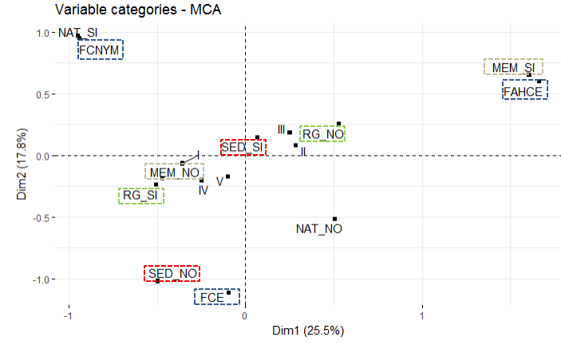

```{r, echo= FALSE}
knitr::opts_chunk$set(error = TRUE)
```


```{r, echo=FALSE, warning=FALSE, message=FALSE}

#Echo false evita que salga código en output, lo esconde. Lo mismo warnings y message, cuando carga paquetes que a aveces pone warnings.

#Al final de este script, si anduvo todo bien probá de sacar el output o informe en algún formato.

library(tidyverse)
```


```{r, echo=FALSE, warning=FALSE, message=FALSE, eval=FALSE}

# IMPORTO CSV, ESTA ES MI RUTA, TENDRÍAS QUE HACER LA TUYA

presencia <- read_delim("C:/Users/User/Desktop/Seba/Datasets enraizados. No tocar ni mover/Presencia_investigadores_UNLP_en_RG_y_RIS.csv", ", 
    ";", escape_double = FALSE, trim_ws = TRUE)
```


```{r , echo=FALSE, warning=FALSE, message=FALSE}

# RUTA DE ACCESO DE CLAUDIA AL ARCHIVO (mantener el nombre presencia):

presencia2 <- read_delim("/Users/claudiamgonzalez/Documents/INV/DATOS/Repositorios-RG/2017_12_7/Tabla_datos_RG_y_RIS_actualizada.csv", 
    ";", escape_double = FALSE, trim_ws = TRUE)

```


```{r, echo=FALSE, warning=FALSE, message=FALSE}
#CONVIERTO LAS VARIABLES A USAR EN FACTORES:

presencia2$Fac <- as.factor(presencia2$Facultad)
presencia2$Sex <- as.factor(presencia2$Sexo)
presencia2$Cat <- as.factor(presencia2$Categoria)
presencia2$Ed <- as.factor(presencia2$Edad)
presencia2$RG <-  as.factor(presencia2$ResearchGate)
presencia2$Repos <- as.factor(presencia2$Repos)


#Al la derecha del dataset hay nuevas variables que son factores.
```


```{r, echo=FALSE, warning=FALSE, message=FALSE}
#Creo un nuevo dataset a partir del anterior:
presencia3 <- presencia2 %>% 
  select(Fac, Sex, Cat, Ed, RG, Repos)
```

```{r, echo=FALSE, warning=FALSE, message=FALSE}
save(presencia3,file="presencia3.RData")
load(file="presencia3.RData")
```


```{r, echo=FALSE, warning=FALSE, message=FALSE}

#Saco los NA de Categoría de incentivos, sino deforman el plano factorial
presencia3 <- presencia3 %>% 
  filter(!is.na(Cat)) %>%
  filter(!is.na(Ed)) %>%
  filter(!Ed == "Menor-30") 
```


```{r, echo=FALSE, warning=FALSE, message=FALSE }
# CARGO PAQUETES (fijate que los tengas instalados en el rígido)

library("FactoMineR")
library("factoextra")
```


```{r, echo=FALSE, warning=FALSE, message=FALSE}
#Una función para plotear las variables, variables con bajo n pueden distorsionar el analisis
#i in 2:4 selecciona columnas del dataset
for (i in 1:6) {
  plot(presencia3 [,i], main=colnames(presencia3)[i],
       ylab = "Count", col="steelblue", las = 2)
  }
```


```{r, echo=FALSE}
#Aca MCA se hace sobre el dataset presencia1:

presencia3.mca <- MCA(presencia3, graph = FALSE)

#crea un objeto list
```


```{r, echo=FALSE}
#aca se ve claramente la relación entre variables, cuál carga en qué dimensión

fviz_mca_var(presencia3.mca, choice = "mca.cor", 
            repel = TRUE, # Avoid text overlapping (slow)
            ggtheme = theme_gray())
```

La categoría de incentivos casi no influye en ninguna dimensión... es bastante irrelevante, la facultad carga bien en ambas dimensiones.


```{r, echo=FALSE}
fviz_mca_var(presencia3.mca, 
             repel = TRUE, 
             ggtheme = theme_minimal())
```


```{r, echo=FALSE}
#Lo anterior en blanco y negro...

###ESTE ES EL GRAFICO CENTRAL QUE HAY QUE INTERPRETAR

fviz_mca_var(presencia3.mca, col.var="black", shape.var = 15,
             repel = TRUE)
```

A acontinuación uso simplemente el word para tunearlo un poco (sólo ves el gráfico en el visor cuando apretás Preview arriba en el ícono Knit) 

#

Se observa que la dimensión 1 explica el 26% de la varianza, mietras que la 2 el 18%, entre ambas el 44%, lo cuál muestra una reducción de dimensiones satistactoria.

El gráfico que sigue ayuda a la interpretación pues indica cuales son las categorías que más contribuyen a la solución factorial, son las que están más rojas, más hot.


```{r, echo=FALSE}
fviz_mca_var(presencia3.mca, col.var = "cos2",
             gradient.cols = c("#00AFBB", "#E7B800", "#FC4E07"), 
             repel = TRUE, # Avoid text overlapping
             ggtheme = theme_minimal())
```

Acá que se ve algo parecido: qué categoría contribuye a qué dimensión:

```{r, echo=FALSE}
fviz_contrib(presencia3.mca, choice = "var", axes = 1, top = 15)

fviz_contrib(presencia3.mca, choice = "var", axes = 2, top = 15)

```


